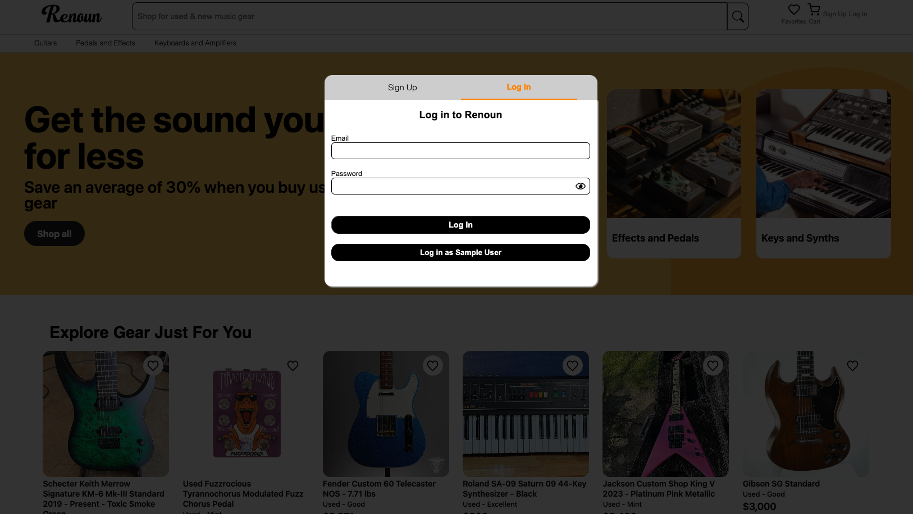
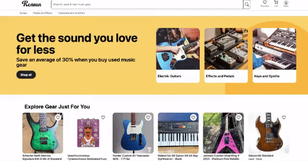
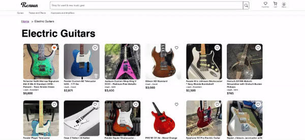
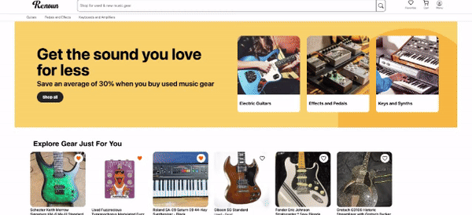
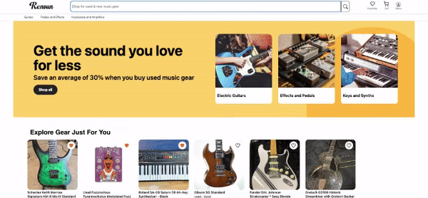

# WELCOME TO RENOUN

Please visit the [Live Site!](https://render-renoun-1.onrender.com/)


### Introduction

Renoun is a clone of Reverb, a subsidiary website of Etsy, which specializes in connecting the buyers and sellers of new and used musical instruments and equipment.  A Renoun user can sign up for an account, add instruments as favorites to follow and view on their favorites page, add items to their cart and purchase items, create reviews for sellers from whom they have made purchases, and perform a search for existing inventory.  As an amateur musician, I enjoy visiting the site and appreciate the asthetics and how the presentation encourages frequent visits to browse inventory.  


The technologies used in this project include: 

* Languages: Javascript, Ruby, HTML, CSS, and JSX
* Frontend: React-Redux
* Database: PostgreSQL
* Hosting: Render
* Asset Storage: AWS Simple Cloued Storage (S3)


# MVPs

## Profiles

A Renoun user is able to create a new profile, which persists on both the front and backend.  


Users are required to be logged in in order to favorite an instrument, add an item to their cart, or visit past orders.  Failed sign in/sign up attempts are redirected to the appropriate page with the relevant messages displayed.



## Instrument Categories

The homepage features a carousel of instruments with pictures and instrument details.  Users can navigate from the homepage to specific instrument category pages which feature similar carts of instruments and information. 


### Infinite instrument carousel

```

    return(
        <>
        <div id='if-wrap-wrap'>
            <div id='infinite-carousel-wrap'>
            {availableInstruments.map((instrument)=>{
                const pos = instruments.indexOf(instrument)+1
                return(           
                    <div className='thumb-instrumentWrapper' 
                            id='thumb-inst-wrap-inf'>
                        <div className='carousel-fav-button'>
                            <div src='/assets/images/emptyHeart.png' 
                                className = 'likeOn' 
                                id={`ioMdHeart${pos}_${index}`} 
                                onClick={(e)=> addFavorite(instruments[pos-1].id, pos, e)} >
                            </div>  
                            <div src="/assets/images/filledHeart.png"   
                                className = 'likeOff' id={`luHeart${pos}_${index}`} 
                                onClick={(e)=> unFavorite(instruments[pos-1].id, pos, e)} > 
                            </div>
                        </div>
                
                
                        <Link className='thumb-link' 
                                to={`/instruments/${instruments[pos-1].id}`}>
                            <ul id='thumb-dets'>
                                
                                <div key ={`wrap${instruments[pos-1].id}`}
                                        className='words-wrap'>
                                    <div key ={`instName${instruments[pos-1].id}`}                      
                                        className='thumb-instrumentName'>{instruments[pos-1].itemName}
                                    </div>
                                    <li key ={`condition${instruments[pos-1].id}`}          
                                    className='thumb-condition'>{instruments[pos-1].condition}</li>
                                    <li key ={`price${instruments[pos-1].id}`}
                                        className='thumb-price'>
                                        {formatter.format(instruments[pos-1].price)}
                                    </li>
                                </div>
                            </ul>
                        </Link>
                    </div>      
                )
            })}
            </div> 
        </div>
        </>
    )
}

```


## Instrument Show Page

Clicking upon an individual instrument's icon in the carousel or cart will reveal the instrument's show page which includes an enlarged image of the instrument, more information including an in depth description of the instrument, buttons to add the instrument to the cart and to add it to favorites (see favorites below), as well as reviews of the seller of the instrument. 


## Favorites

Users can add instruments to their favorites list both from the individual instruments show page and the instrument carousel/carts.  Favorites persist between login/logouts, and are updated instantly with a click on both the front and back end.  The favorite status of an instrument is shown on all carousels/carts that it may appear on as well as the individual show page.

The total number of users that have 'favorited' the instrument is displayed on the instrument's show page.  This number updates live on the front and backend as users favorite/unfavorite an instrument. 



### JSX Code to keep hearts with favorite/unfavorite
```
useEffect(()=>{
        const availableInstruments = instruments.filter((instrument)=>instrument.available===true)
    }, [orders.length])
    const ioHearts = [];
    const luHearts = []
    useEffect(()=>{
        let i = 1
   
        while (i <= availableInstruments.length){

            ioHearts[i]= document.getElementById(`ioMdHeart${i}_${index}`)
            luHearts[i] = document.getElementById(`luHeart${i}_${index}`)
            if(instruments[i] && ioHearts[i]){
                if (favoriteInstrumentIds.includes(instruments[i-1].id)){
                    ioHearts[i].style.display='none'
                    luHearts[i].style.display='flex'
                } else {
                    ioHearts[i].style.display='flex'
                    luHearts[i].style.display='none'
                }

            }
          
            i+=1
        }
    }, [favoritesObj])

    const addFavorite = (instrumentId, buttonId, e) =>{
        if(currentUser){
            const favorite = {
                instrumentId,
                favoriterId: currentUser.id
            }
            dispatch(createFavorite(favorite))
        } else {
            modal.style.display='flex'
            modal.className='login'
            loginNav.className='active'
            signupNav.className='inactive'
            loginForm.style.display='flex'
            signupForm.style.display='none'
         
            loginSquare.className='active-menu-nav-wrapper'
            signupSquare.className='passive-menu-nav-wrapper'
          
        }
   
    }

    const unFavorite = (instrumentId, buttonId, e) =>{
        let favoriteId
    
         if(currentUser){
            favorites.forEach((favorite)=>{

                if(favorite.instrumentId === instrumentId){
                    favoriteId = favorite.id
                }
            })
            dispatch (deleteFavorite(favoriteId))
         }
         else {
            modal.style.display='flex'
            modal.className='login'
            loginNav.className='active'
            signupNav.className='inactive'
            loginForm.style.display='flex'
            signupForm.style.display='none'
            loginSquare.className='active-menu-nav-wrapper'
            signupSquare.className='passive-menu-nav-wrapper'   
        }
    }

```


## Cart

Users can add and delete items from their cart from the instrument's show page.  The cart dynamically updates as more items are added, and it shows the total price for all instrumetns in the cart.  The cart icon in the navbar updates to show the number of items in the cart as well.  The cart can be accessed from any page by clicking the cart icon in the navbar. 

Once the user decides to make a purchase, they can click through to a confirmation page which has a dummy form to collect payment information.  Upon confirmation at this page, the user is sent to an order confirmation page which recaps the current order and relevant information.  

At any time, the user can access their past orders through the dropdown menu under the user icon.  This will guide them to a page with a list of all past orders and order status.




## Seller Reviews

After completing a purchase, on the orders page, users have the option of leaving a review for the seller.  These reviews then are displayed on any instrument show page for instruments for sale by that particular seller.  Sellers are awarded a star rating for every review recieved.  The total number of reviews, and the average star rating is displayed on the instrument show page.  

Users can also update their previous reviews if perceptions of sellers change over time. 





### Seller Review Box on Instrument Show Page:
```
return(
        <>
        <div id='seller-wrapper'>
                <h1 className='aboutThisListing'>About the Seller</h1>
                <div id='seller-dets'>
                    <div id='shop-wrap'>
                        <div id='shop-image-left'></div>
                    </div>
                    <h2 id='seller-info'>
                        {sellerStoreName}
                    </h2>
            
                </div>
                <hr className='sellerLine' />
                <div className='reviews-header'>
                    Seller Reviews  {avgStars(average)}   ({reviews.length})
                </div>
                {reviewsOne.map((review)=>{
                    return(
                        <>
                            <hr className='review-divider'></hr>
                            <div class-name='avg-stars-img'> {stars(review.stars)}</div>
                            <h1 className='review-title'>
                            {review.title}
                            
                            </h1>
                            <div className='author-date'>
                                <p className='review-author'>
                                {abbrevName(review)}
                                </p>
                                <p className='review-date-created'>
                                   -  {wordifyDate(review)}
                                </p>
                            </div>
                        
                            <p className='review-body'>
                                {review.body}
                            </p>  
                        </>
                    )
                })}
        </div>
        </>
    )

```


## Search

Users can perform a simple search of the instruments available at the frontend at any given time.  The search box automatically returns prompts from instrument names and brands that potentially match the current entry in the search box.  Relevant search results are presented in the results page. 





### Search Outcomes Simple Function & Results Page


```
function Outcomes(){
    const location=useLocation();
    const {searchWord} = location.state
    const instruments = useSelector(state => Object.values(state.instruments))
    const searchResults = [];
    instruments.forEach((instrument)=>{
      if(instrument.available){
        if(instrument.itemName.toLowerCase().includes(searchWord.toLowerCase()) ||
        (instrument.model) && instrument.model.toLowerCase().includes(searchWord.toLowerCase()) ||
        instrument.brand.toLowerCase().includes(searchWord.toLowerCase()) ||
        instrument.category.toLowerCase().includes(searchWord.toLowerCase())){
            searchResults.push(instrument)
        }
      }
    })

    let rowRequirement
   if(searchResults.length%6===0){
    rowRequirement = searchResults.length/6
   } else {
    rowRequirement = Math.floor(searchResults.length/6)+1
   }
   console.log(rowRequirement)

   let i=0
   let allRows = []

   while(i<rowRequirement){
  
    let row = searchResults.slice((i*6+0),(i*6+6))
    allRows.push(row)
    i+=1
   }

   console.log(allRows)

    return(
        <div id='search-results-wrapper-wrapper'>
            <div id='search-results-wrapper'>
                <h1 id='results-count'>{searchResults.length} Results <span id='searchTermWrap'>for "{`${searchWord}`}"</span></h1>
                {allRows.map((row)=>{
                    return(
                        <div id='favs-row-wrapper'>
                              <RealGenericCarousel row={row} rowId={row[0].id}/>
                        </div>
                      
                    )
                })}
            </div>
        </div>
        
    )
}
```


### Thank you!

Renoun was created in a 14 day timeframe.  I hope it made you want to go out and make music!